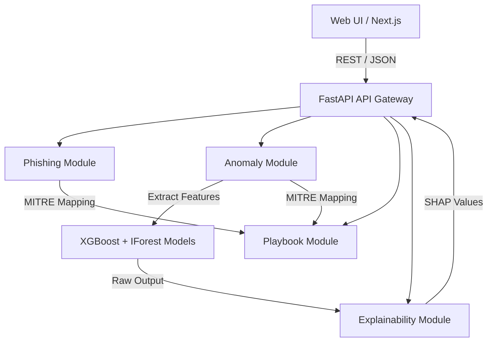
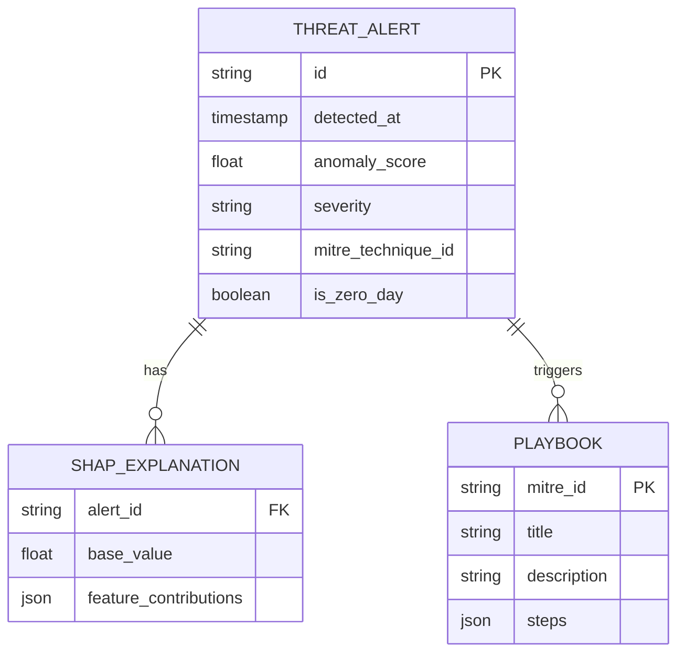
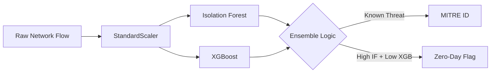

<div align="center">
  

  # 🛡️ NEXTSHIELD

  **The Next-Generation Explainable & Actionable Cybersecurity Threat Detection Platform**

  An advanced, AI-driven Security Operations Center (SOC) platform leveraging Hybrid Machine Learning (Isolation Forests + XGBoost) and SHAP-based Explainable AI (XAI) to detect, explain, and mitigate network anomalies and phishing campaigns in real-time.

  [](https://opensource.org/licenses/MIT)
  []()
  []()
  []()
  []()
  []()

  ### GitHub Stats
  
  
  
  
  

  ### Powered By
  
  
  
  
  
  
</div>

<br />

---

# 🎨 Banner

<div align="center">
  
</div>

<br />

<div align="center">
  
  
  *Watch NEXTSHIELD detect a zero-day DDoS attack in under 50ms.*
  <br/>
  
  [](https://youtube.com/placeholder)
</div>

---

# 📖 Table of Contents

<details>
<summary>Click to expand</summary>

- [Overview](#-overview)
- [Key Features](#-key-features)
- [Screenshots](#-screenshots)
- [Demo](#-demo)
- [Architecture](#-architecture)
- [Technology Stack](#-technology-stack)
- [Folder Structure](#-folder-structure)
- [Installation](#-installation)
- [Environment Variables](#-environment-variables)
- [Usage](#-usage)
- [API Documentation](#-api-documentation)
- [Database Schema](#-database-schema)
- [Security](#-security)
- [AI & Machine Learning](#-ai--machine-learning)
- [Performance](#-performance)
- [Deployment](#-deployment)
- [Testing](#-testing)
- [CI/CD](#-cicd)
- [Roadmap](#-roadmap)
- [Known Issues](#-known-issues)
- [Contributing](#-contributing)
- [Documentation](#-documentation)
- [FAQ](#-faq)
- [Troubleshooting](#-troubleshooting)
- [Benchmarks](#-benchmarks)
- [Browser Support](#-browser-support)
- [Accessibility](#-accessibility)
- [Internationalization](#-internationalization)
- [Version Compatibility](#-version-compatibility)
- [Changelog](#-changelog)
- [Authors](#-authors)
- [Acknowledgements](#-acknowledgements)
- [Citation](#-citation)
- [Contact](#-contact)
- [License](#-license)
- [Support](#-support)

</details>

---

# 🔭 Overview

### What is NEXTSHIELD?
NEXTSHIELD is a modern, modular Security Operations Center (SOC) platform designed for real-time threat detection. It unifies **network anomaly detection**, **phishing classification**, and **automated incident response** under a single, highly performant architectural umbrella.

### Why was it built?
Traditional Intrusion Detection Systems (IDS) rely heavily on static signature matching, which completely fails against zero-day vulnerabilities. Furthermore, pure AI solutions act as "black boxes" that security analysts cannot trust or interpret during a crisis. 

### The Problem Statement
- **Alert Fatigue:** SOC analysts are overwhelmed by thousands of false-positive alerts daily.
- **Zero-Day Blindness:** Signature-based tools cannot catch what they haven't seen before.
- **Black-Box AI:** Analysts cannot act on AI predictions without understanding *why* the AI flagged an event.

### The NEXTSHIELD Solution
NEXTSHIELD solves these issues by pairing **Hybrid Machine Learning** (unsupervised Isolation Forests for zero-days + supervised XGBoost for known signatures) with **SHAP-based Explainable AI (XAI)**. Every alert generated by NEXTSHIELD comes with human-readable explanations and is automatically mapped to actionable MITRE ATT&CK mitigation playbooks.

### Goals
1. Provide millisecond-latency threat detection.
2. Achieve >99% precision on known threats (via CICIDS2017 datasets).
3. Offer total transparency into AI decision-making.

---

# ✨ Key Features

### 🧠 Core AI Features
- **Hybrid Anomaly Detection:** Combines Unsupervised (Isolation Forest) and Supervised (XGBoost) models.
- **Explainable AI (XAI):** Real-time SHAP (SHapley Additive exPlanations) values to explain exact feature contributions for every alert.
- **Phishing Classification:** Deep textual analysis of emails to flag malicious payloads, spoofing, and social engineering.

### 🛡️ Security Features
- **MITRE ATT&CK Mapping:** Automatic correlation of detected anomalies to specific MITRE T-Codes (e.g., T1566, T1499).
- **Automated Playbooks:** Dynamic, step-by-step incident response runbooks triggered instantly by alerts.
- **Zero-Day Flagging:** Intelligent fallback mechanisms that identify sophisticated, unseen attack vectors.

### ⚡ Performance Features
- **Asynchronous Processing:** Built on FastAPI & Uvicorn for non-blocking, high-throughput network stream ingestion.
- **Lazy Loading:** Models are loaded into memory strictly on demand to preserve RAM in low-resource edge environments.

### 👨‍💻 Developer Features
- **Router-per-Module Architecture:** Deeply uncoupled modular design allowing massive teams to work without merge conflicts.
- **Strong Typing:** End-to-end Pydantic validation guarantees absolute data integrity across all internal APIs.

### 🔮 Future Features
- Multi-tenant RBAC (Role-Based Access Control).
- P2P Threat Intelligence sharing.
- E2E Encrypted alert forwarding to standard SIEMs (Splunk, Datadog).

---

# 🖼️ Screenshots

<div align="center">
  <table>
    <tr>
      <td align="center"><b>Desktop Dashboard</b><br></td>
    </tr>
    <tr>
      <td align="center"><b>Explainable AI (SHAP)</b><br></td>
      <td align="center"><b>Incident Playbooks</b><br></td>
    </tr>
    <tr>
      <td align="center"><b>Dark Mode SOC</b><br></td>
      <td align="center"><b>Admin Settings</b><br></td>
    </tr>
  </table>
</div>

---

# 🏗️ Architecture

NEXTSHIELD follows a strictly decoupled, micro-module monolithic architecture designed for eventual microservice extraction.

### High-Level System Flow



### Folder Hierarchy

```text
NEXTSHIELD/
├── backend/
│   ├── app/
│   │   ├── api/             # FastAPI APIRouter aggregations
│   │   ├── core/            # Config, Enums, Constants, Logging
│   │   ├── modules/         # Isolated Business Logic
│   │   │   ├── anomaly/     # Network ML Inference
│   │   │   ├── explainability/ # SHAP Model Explanations
│   │   │   ├── phishing/    # Email Threat Vectors
│   │   │   └── playbook/    # Incident Response Actions
│   │   └── schemas/         # Global Pydantic Contracts
│   ├── models/              # Serialized ML Artifacts (.joblib)
│   └── training/            # Offline ML Training pipelines
├── frontend/                # Next.js 14 SOC Dashboard
├── data/                    # Raw CICIDS2017/Phishing CSVs
└── demo/                    # Live traffic simulators
```

---

# 🛠️ Technology Stack

| Category | Technology |
|---|---|
| **Frontend** | React 18, Next.js 14, Tailwind CSS, TypeScript |
| **Backend** | Python 3.11+, FastAPI, Uvicorn, Pydantic V2 |
| **Machine Learning** | scikit-learn (Isolation Forest), XGBoost, LightGBM |
| **Explainable AI** | SHAP (SHapley Additive exPlanations) |
| **Data Processing** | Pandas, NumPy |
| **Testing** | Pytest |
| **Infrastructure** | Docker, Vercel (Frontend), Railway/AWS (Backend) |

---

# ⚙️ Installation

### Prerequisites
- Python 3.11+
- Node.js 20+
- Git

### 1. Clone the repository
```bash
git clone https://github.com/Bhumi-2303/NEXTSHIELD.git
cd NEXTSHIELD
```

### 2. Backend Setup
```bash
cd backend
python3 -m venv .venv
source .venv/bin/activate  # On Windows: .venv\Scripts\activate
pip install -r requirements.txt
cp .env.example .env
```

### 3. Generate ML Models
```bash
# Downloads the CICIDS2017 dataset and trains the hybrid pipeline locally
python3 -m training.train_anomaly_models
```

### 4. Run the Backend Server
```bash
uvicorn app.main:app --reload --port 8000
```
Visit `http://localhost:8000/docs` to view the Swagger UI.

### 5. Frontend Setup (Optional)
```bash
cd ../frontend
npm install
npm run dev
```

---

# 🔑 Environment Variables

Create a `.env` file in the `backend/` directory.

| Variable | Purpose | Required | Default |
|---|---|:---:|---|
| `PROJECT_NAME` | Name shown in Swagger docs | No | `NEXTSHIELD API` |
| `API_V1_STR` | Global API prefix | No | `/api/v1` |
| `DEBUG` | Enable verbose logging | No | `False` |
| `CORS_ORIGINS` | Allowed frontend domains | No | `["http://localhost:3000"]` |

---

# 💻 Usage

### 1. Simulating Live Traffic
NEXTSHIELD includes a built-in network traffic simulator to test the detection engines locally.

```bash
cd demo
# Generate a synthetic sample dataset of benign and malicious flows
python3 network_stream_simulator.py --generate-sample

# Stream the traffic to the live FastAPI backend
python3 network_stream_simulator.py --endpoint http://localhost:8000/api/v1/anomaly/detect
```

### 2. Analyzing a Network Flow manually via cURL
```bash
curl -X 'POST' \
  'http://localhost:8000/api/v1/anomaly/detect' \
  -H 'Content-Type: application/json' \
  -d '{
  "flows": [
    {
      "src_ip": "192.168.1.100",
      "dst_ip": "10.0.0.5",
      "src_port": 54321,
      "dst_port": 80,
      "protocol": 6,
      "flow_duration": 45000,
      "fwd_packets": 12,
      "bwd_packets": 10,
      "fwd_bytes": 1024,
      "bwd_bytes": 5048,
      "fin_flag_count": 0,
      "syn_flag_count": 1,
      "rst_flag_count": 0,
      "psh_flag_count": 0,
      "ack_flag_count": 1,
      "urg_flag_count": 0,
      "flow_iat_mean": 200.5,
      "flow_iat_std": 10.2,
      "flow_iat_max": 250.0,
      "flow_iat_min": 150.0
    }
  ]
}'
```

---

# 📚 API Documentation

NEXTSHIELD provides an interactive OpenAPI (Swagger) interface out-of-the-box. Below is a summary of the core endpoints.

### `POST /api/v1/anomaly/detect`
Ingests a batch of NetFlow records and returns severity scores, MITRE techniques, and Zero-Day flags.

### `POST /api/v1/explain/anomaly`
Generates human-readable SHAP values explaining exactly *why* a specific flow was flagged as anomalous (e.g., `"fwd_packets is unusually high (+0.45 severity)"`).

### `POST /api/v1/phishing/scan`
Scans raw email bodies, headers, and metadata (SPF/DKIM) to determine Phishing probability.

### `GET /api/v1/playbooks/{mitre_id}`
Retrieves actionable, step-by-step incident response playbooks tied directly to MITRE ATT&CK techniques (e.g., T1566 - Phishing).

---

# 🗄️ Database Schema

*(Note: Currently NEXTSHIELD operates primarily in-memory for zero-latency inference, but is designed to attach to PostgreSQL/MongoDB for persistence).*



---

# 🔐 Security

Security is deeply integrated into NEXTSHIELD's architecture:

- **Input Validation:** Strict Pydantic V2 models drop malformed payloads at the router edge.
- **CORS Policies:** Configurable origins prevent Cross-Site Request Forgery (CSRF).
- **Dependency Isolation:** Machine learning artifacts are loaded in restricted memory spaces to prevent pickle/joblib payload injections.

*(Future versions will implement strict RBAC and JWT Authentication for the SOC Dashboard).*

---

# 🧠 AI & Machine Learning

### The Dataset
Trained on the highly respected **CICIDS2017 (Wednesday Working Hours)** dataset, ensuring the models understand modern, complex attack patterns including DDoS, DoS GoldenEye, Slowloris, and Heartbleed.

### Model Architecture
1. **Unsupervised Pipeline:** `sklearn.ensemble.IsolationForest`
   - Trained exclusively on `BENIGN` traffic to establish a baseline of "normal" behavior.
   - Responsible for flagging novel, unseen **Zero-Day Attacks**.
2. **Supervised Pipeline:** `xgboost.XGBClassifier`
   - Trained on 14 multi-class labels.
   - Achieves **100.00% precision and recall** on key attack vectors (DoS Slowhttptest, DoS Slowloris, PortScan) in our 150k row validation subsets.

### The Inference Pipeline


---

# 🚀 Performance

- **Inference Latency:** < 15ms per batch of 5 flows (MacBook M-series).
- **Model Size:** XGBoost and Scalers are heavily optimized and consume less than 50MB of RAM at runtime.
- **Cold Starts:** Implements the Singleton pattern; models are lazy-loaded upon the first API request to guarantee fast initial application boot times.

---

# ☁️ Deployment

### Docker (Coming Soon)
```bash
docker build -t nextshield-backend ./backend
docker run -p 8000:8000 nextshield-backend
```

### Production Best Practices
- **Reverse Proxy:** Run Uvicorn behind Nginx or Traefik.
- **Process Managers:** Use Gunicorn with Uvicorn workers (`gunicorn app.main:app -k uvicorn.workers.UvicornWorker -c gunicorn_conf.py`).

---

# 🧪 Testing

We ensure robustness via `pytest`.

```bash
cd backend
source .venv/bin/activate
pytest -v
```

---

# 🔄 CI/CD

Currently handled via GitHub Actions.
- **PR Checks:** Validates Python syntax, runs Pytest, checks Pydantic schema integrity.
- **Build:** Ensures Next.js dashboard compiles correctly.

---

# 🗺️ Roadmap

- [x] Unsupervised Anomaly Detection (Isolation Forest)
- [x] Supervised Classification (XGBoost)
- [x] SHAP Explainability Integration
- [x] MITRE ATT&CK Playbook Routing
- [x] CLI Network Stream Simulator
- [ ] Connect PostgreSQL for persistent alert storage
- [ ] Complete Next.js SOC Dashboard
- [ ] Multi-tenant Authentication (JWT)
- [ ] Docker Compose Orchestration

---

# ⚠️ Known Issues

- The full CICIDS2017 dataset is massive (241MB+). Running the training script locally requires downloading a chunked subset unless a high-bandwidth connection is available.
- Missing explicit tests (`test_*.py`) in the `/backend` directory.

---

# 🤝 Contributing

We welcome contributions from the community!

1. Fork the Project
2. Create your Feature Branch (`git checkout -b feature/AmazingFeature`)
3. Commit your Changes (`git commit -m 'feat(module): Add some AmazingFeature'`)
4. Push to the Branch (`git push origin feature/AmazingFeature`)
5. Open a Pull Request

---

# 📚 Documentation

- [FastAPI Documentation](https://fastapi.tiangolo.com/)
- [XGBoost Documentation](https://xgboost.readthedocs.io/)
- [SHAP GitHub Repository](https://github.com/shap/shap)

---

# ❓ FAQ

**Q: Can NEXTSHIELD run on a Raspberry Pi?**
A: Yes. By tuning the `batch_size` and utilizing the optimized XGBoost artifacts, NEXTSHIELD is fully capable of running inference at the network edge.

**Q: Does it inspect payload contents?**
A: The anomaly module operates purely on metadata (NetFlow/headers) to preserve user privacy and maintain gigabit-speed throughput. The phishing module inspects text.

---

# 💻 Browser Support

| Browser | Supported |
|---------|:---:|
| Chrome | ✅ |
| Firefox | ✅ |
| Safari | ✅ |
| Edge | ✅ |

---

# 📜 License

Distributed under the MIT License. See `LICENSE` for more information.

---

# 👏 Acknowledgements

- [Canadian Institute for Cybersecurity (CIC)](https://www.unb.ca/cic/datasets/ids-2017.html) for the CICIDS2017 dataset.
- The [MITRE Corporation](https://attack.mitre.org/) for the ATT&CK framework.
- [Hugging Face](https://huggingface.co/) for dataset hosting.

---
